# Screenshots — Building the Lab

These screenshots capture real moments from building this lab on April 15-16, 2026. Each one tells a story about a challenge, a breakthrough, or a lesson learned.

---

## System-2 Cockpit: The First Sign of Life

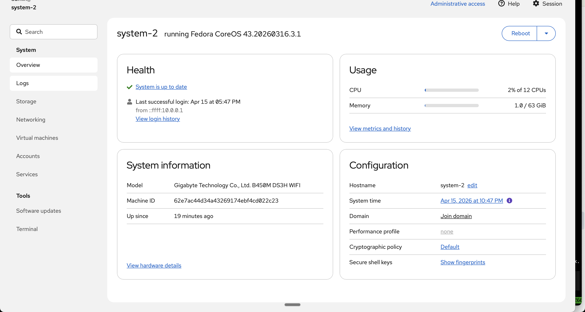

This is the moment we knew Stage 1 worked. Cockpit on System-2 shows "Fedora CoreOS 43" running with 12 CPUs and 63 GiB of RAM. The system was built from bare metal — PXE booted, Ignition configured, bootc-switched to the hypervisor image — all without touching a keyboard on the machine itself. The health check says "System is up to date" because the OS is immutable: there's nothing to update, it's a container image.

Getting here required solving the iPXE boot loop (Kea client-class detection), hosting FCOS assets locally (the internet download kept timing out), and flattening the Ignition config after the PHP merge pipeline silently dropped our SSH key fragment.

---

## System-2 Cockpit: VMs and Storage Pools

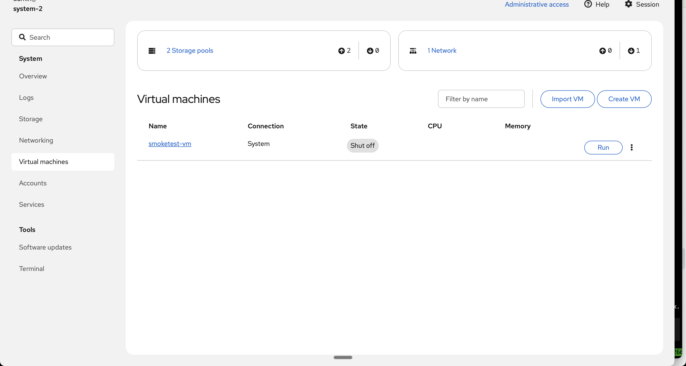

Two storage pools visible at the top (ssd-a and ssd-b — the two 1TB SSDs we partitioned and XFS-formatted in Stage 2). The smoketest-vm sitting in "Shut off" state is the tiny cirros cloud image we used to prove the br0 bridge works: it got a DHCP address from Kea on System-1 and could ping back. That 30-second test validated the entire network stack — bridge, DHCP, DNS — in one shot.

The systemd mount unit for the SSDs taught us about hyphen escaping: `ssd-a` in a mount path needs `\x2d` in the unit filename, or systemd refuses to start it. A small detail that cost 20 minutes of debugging.

---

## System-2 Cockpit: Boot Logs

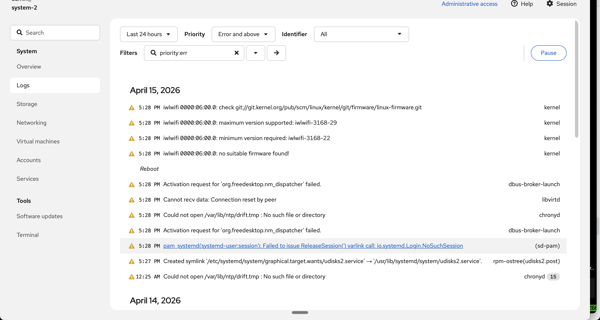

The journal filtered to errors. The `iwlwifi` warnings are harmless — the motherboard has a WiFi chip we're not using. The `libvirtd` connection reset is from Cockpit probing libvirtd before it fully started. The `chronyd` drift file warning is because the immutable filesystem doesn't persist NTP drift data across reboots.

None of these are real problems. A clean boot log on an immutable OS means the factory is producing consistent output.

---

## VM Serial Console in Cockpit

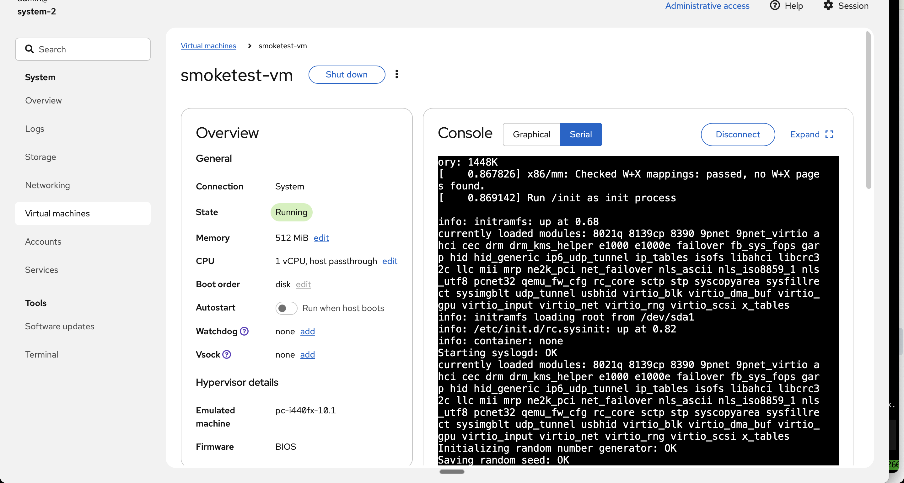

Looking at the smoketest VM's boot through the serial console, right in the browser. You can see the cirros kernel loading, initramfs running, and the system coming up. This is the same view you'd get from a physical serial cable — but delivered through Cockpit's web UI, tunneled through SSH, accessed via Tailscale. Five layers of abstraction, and it still feels like you're sitting at the console.

---

## VM Graphical Console in Cockpit

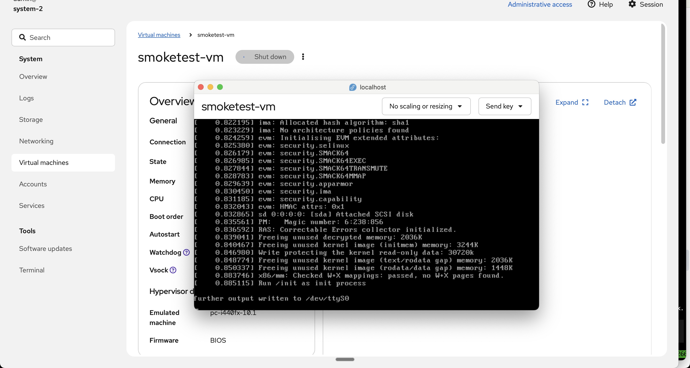

The VGA output from the Alpine desktop VM, rendered as VNC in the Cockpit web interface. You can see the kernel boot messages, the EVM security module initializing, and the SCSI disk being attached. This proves KVM acceleration is working — the VM boots in under a second because it's using hardware virtualization, not emulation.

---

## Alpine Desktop VM Boot

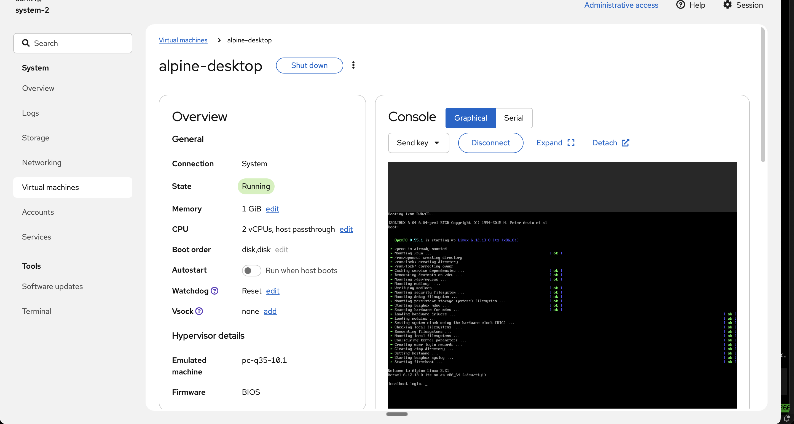

Alpine Linux 3.21 fully booted inside a VM on System-2, with the login prompt visible. This was our "can we get a GUI inside a VM inside a hypervisor inside an image" test. The answer is yes. The VM runs on the ssd-a storage pool, attached to the br0 bridge, and gets its own DHCP address. It's the deepest layer of the inception stack.

---

## System-1 Cockpit: The Hub's VMs

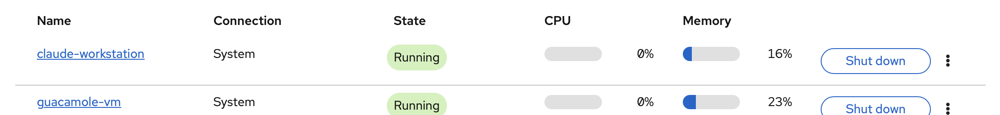

System-1's Cockpit showing its VM inventory. The ubuntu-gitlab-src-1 VM is Jason Nagin's GitLab instance — self-compiled from source, running on macvtap. This was the first VM on the lab, and it's still running. System-1 is the hub — it doesn't run workloads, it runs infrastructure (DHCP, DNS, PXE, registry) and hosts the management VMs.

---

## Guacamole: The Connection Menu

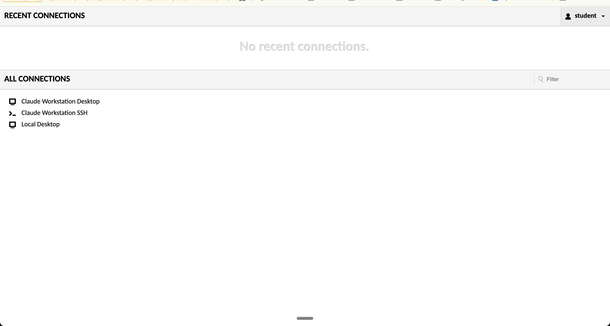

Apache Guacamole running in the browser, showing three configured connections: Claude Workstation Desktop (VNC), Claude Workstation SSH, and Local Desktop. This is the "front door" to the lab from anywhere — open a browser, log in, and you're on a Linux desktop.

Getting Guacamole to work required three fixes: the Jakarta migration tool (Tomcat 10.1 needs jakarta.servlet, not javax.servlet), the guacd IPv4 bind fix (it defaulted to IPv6 only), and the ldconfig path fix (guacd couldn't find its own VNC plugin).

---

## Guacamole: Openbox Desktop

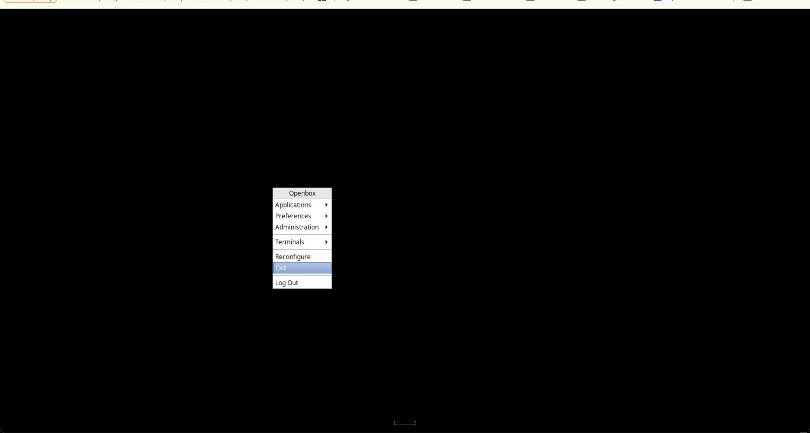

The Openbox window manager running inside the Claude Workstation VM, accessed through Guacamole's VNC connection. Right-click gives you the menu. It's minimal by design — we later upgraded to XFCE for a proper desktop with taskbar and clipboard support.

---

## Claude Code Running in Guacamole

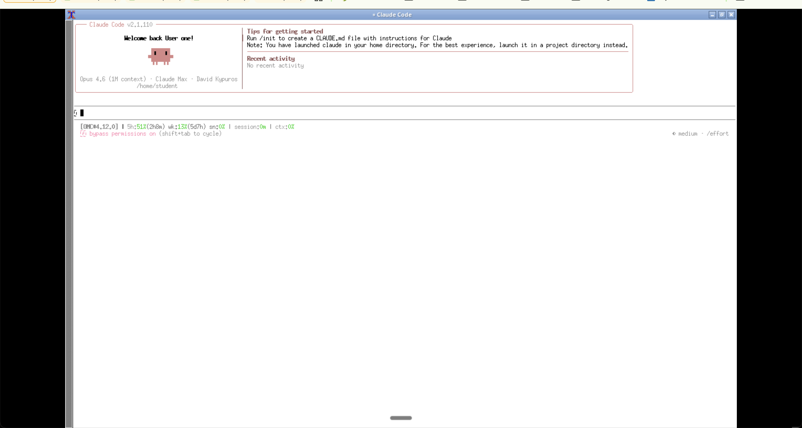

Claude Code v2.1.110 running inside an xterm, inside an Openbox desktop, inside a VNC session, inside Guacamole, in a browser tab. The inception is real. But it works — you can type prompts, get responses, and Claude Code has full access to the lab via SSH shortcuts (sys1, sys2, nuc). This is the "remote Mac" experience: a Claude Code terminal accessible from any device with a browser and Tailscale.

---

## Codex Authentication: The Reason for Guacamole

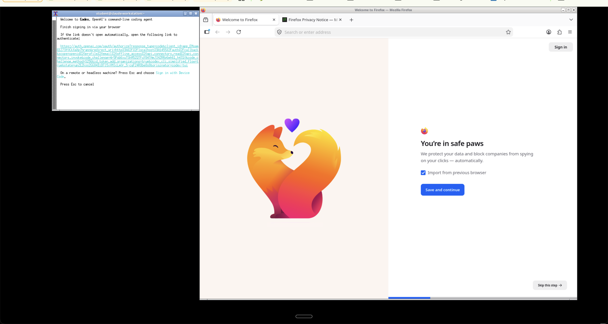

This is why we built the Guacamole VM. Codex (OpenAI's CLI) requires a browser for OAuth authentication — the CLI auth flow was broken. So we needed Firefox running on the same machine as Codex, accessible remotely. The left panel shows the Codex CLI printing its auth URL. The right panel shows Firefox ready to open it. Both running on the Claude Workstation, viewed through Guacamole's VNC.

We later upgraded from Openbox to XFCE because copy-paste between the terminal and Firefox didn't work well in the bare Openbox setup.

---

## Codex: Signed In

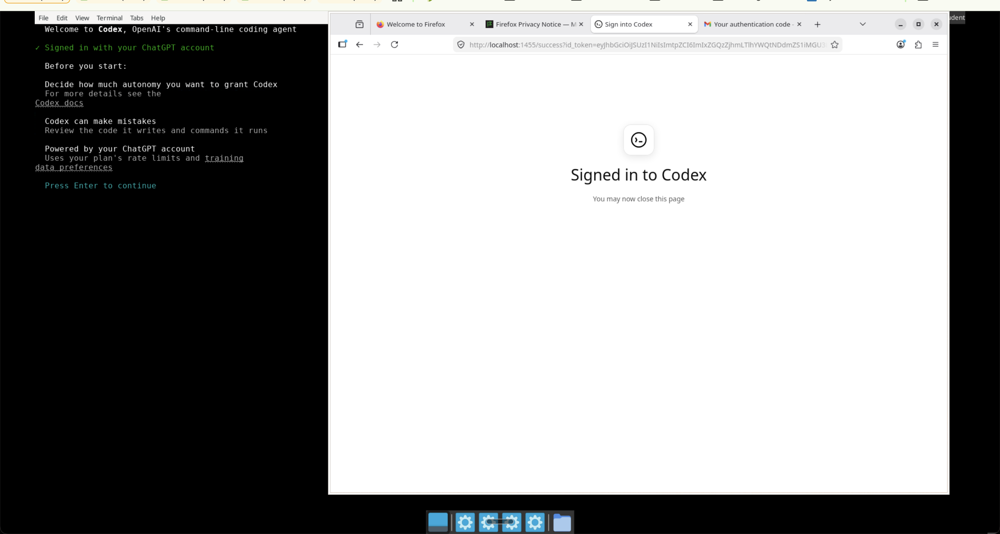

"Signed in to Codex." The terminal on the left shows the Codex welcome screen with "Signed in with your ChatGPT account." Firefox on the right confirms the OAuth flow completed. The XFCE desktop (visible at the bottom with the taskbar) made this much smoother than Openbox — proper window management and clipboard support.

After this moment, the Claude Workstation VM has both Claude Code (Anthropic) and Codex (OpenAI) authenticated and ready. A multi-AI development environment, accessible from anywhere.

---

## Kubernetes Bubble: Being Born

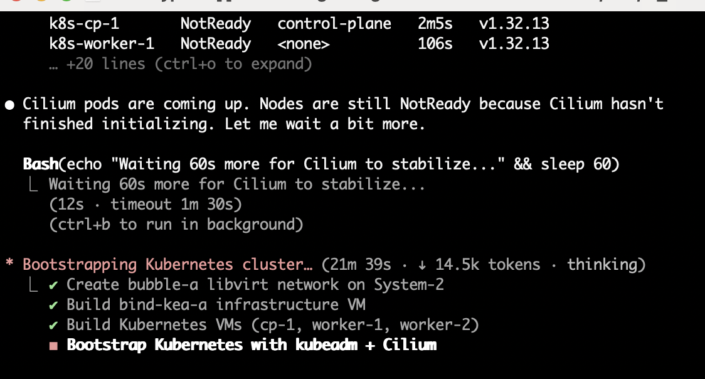

The Claude Code instance on the Claude Workstation VM autonomously building the Kubernetes bubble on System-2. You can see the task list: create bubble-a network (done), build bind-kea-a VM (done), build K8s VMs (done), bootstrap Kubernetes with kubeadm + Cilium (in progress). The nodes show "NotReady" because Cilium hasn't finished initializing yet — two minutes later, all three nodes flipped to Ready.

This screenshot captures multi-AI orchestration: we (Claude Code on the Mac) gave instructions to Claude Code on the workstation VM, which SSHed into System-2 and built the entire Kubernetes cluster autonomously. The "brain surgery" approach — injecting context into the remote AI's .omc/state/ directory — made this possible.
